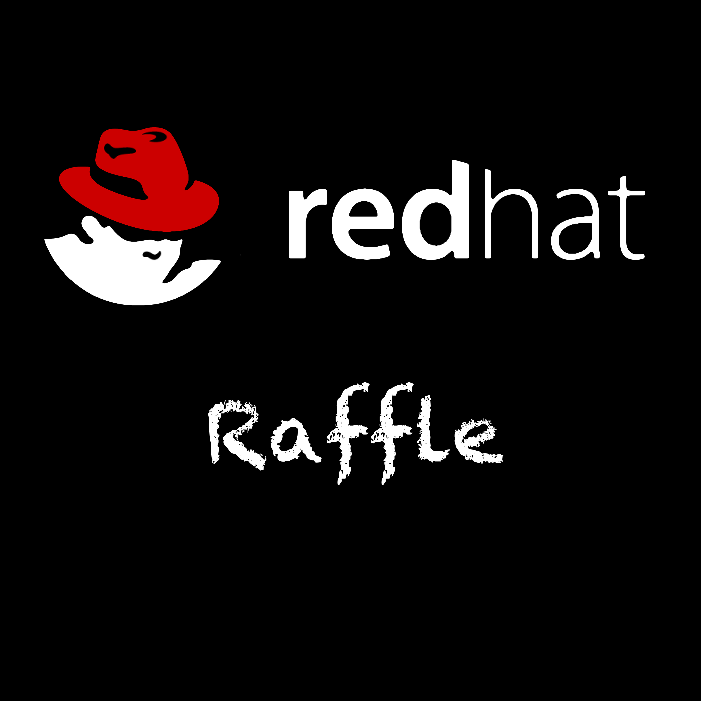

IMPORTANT: Requires Xcode 9.x 0r greater.

IMPORTANT: Requires ngrok.

IMPORTANT: Requires Maven 3.3 or greater.

IMPORTANT: Requires Openshift Container Platform 3.7 or greater.

== Cloning the source code
To clone the Raffle project on your local environment:

[source,bash,options="nowrap",subs="attributes+"]
----
$ git clone git@github.com:tejones/redhat-raffle

$ cd redhat-raffle
----

== Openshift Project
To create the project on your Openshift Cluster:

[source,bash,options="nowrap",subs="attributes+"]
----
$ oc new-project redhat-raffle --display-name="Red Hat Raffle" --description="Red Hat Raffle"
----

== Database
To initialize the database:

[source,bash,options="nowrap",subs="attributes+"]
----
$ cd raffle-persistance

$ oc new-app postgresql-persistent --name=raffle-postgres -p DATABASE_SERVICE_NAME=raffle-postgres -p POSTGRESQL_USER=postgresql -p POSTGRESQL_PASSWORD=postgresql -p POSTGRESQL_DATABASE=raffle

$ oc rsync sql/ <POD_NAME>:/opt/app-root/src

$ oc rsh <POD_NAME> 

sh-4.2$ PGPASSWORD=$POSTGRESQL_PASSWORD psql -h raffle-postgres $POSTGRESQL_DATABASE $POSTGRESQL_USER -f raffle-postgres.ddl

sh-4.2$  exit

$ cd ..
----

== Microservices
To initialize the microservices:

[source,bash,options="nowrap",subs="attributes+"]
----
$ cd raffle-microservice

$ cd raffle-service
$ mvn clean fabric8:deploy -Popenshift -DskipTests
$ cd ..
----

== Red Hat Raffle Mobile App
Load the project into Xcode 9.x or greater. Change the event title, dates and location in the EventController.

Install onto iPhone or iPod for the event. Select the event after the app opens. The Scan button will display with scanned attendees. The list will be empty when you first start the app (since you haven't scanned anyone yet). Press the scan button and hold the camera over the barcode or QR Code. The attendee will be added to the attendee list.

== Web Application
The web app is an HTML5 page that draws a random order list of scanned attendees and iterates through the list until an attendee that is present at the drawing raises their hand, screams, etc.

[source,bash,options="nowrap",subs="attributes+"]
----
Accessing the web application:

TBD
----

